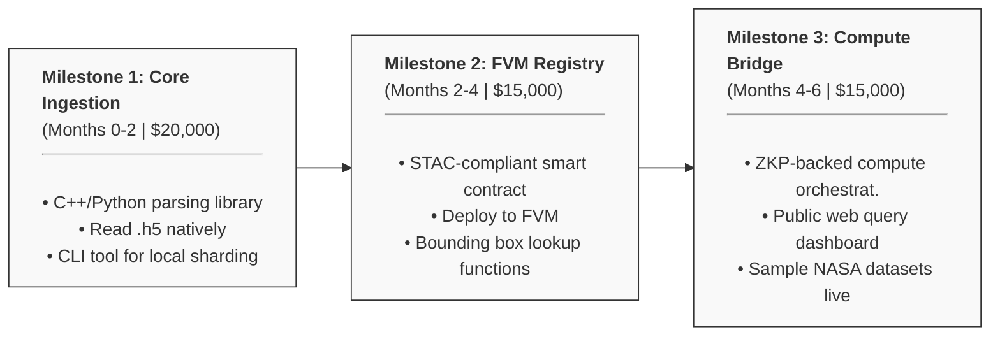
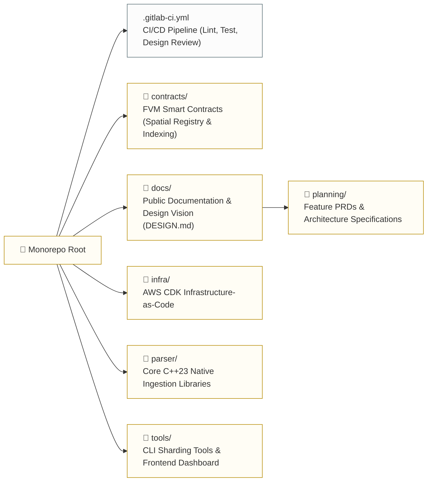

# HDF5-to-IPLD: Unlocking Petabytes of NASA Earthdata for the Filecoin Network

> **Note:** This repository is a funding proposal prepared for the **[Filecoin ProPGF](https://filpgf.io)** program under the "Tooling & Dev Ecosystem" area of focus. It was originally drafted for the legacy devgrants program and has been updated to align with the ProPGF initiative.

### Project Overview

The **HDF5-to-IPLD Tool** bridges the gap between complex
multi-dimensional scientific computing formats and decentralized Web3
storage networks. Developed under the **Decentralized Spatial Data
Infrastructure (DeSDI) Initiative**, this open-source solution
provides a specialized ingestion pipeline to parse, shard, and
permanently index critical public-good datasets, such as petabytes of
NASA earth-observation data, onto the Filecoin network.

Traditional decentralized protocols route and locate data strictly via
cryptographic Content Identifiers (CIDs) rather than geographic or
temporal coordinates. This tool extracts spatial metadata natively
during the ingestion process and integrates it with a decentralized
spatial indexing layer built on the SpatioTemporal Asset Catalog
(STAC) standard. As a result, researchers can query, index, and locate
ATLAS ICESat-2 laser altimetry products and multi-dimensional HDF5
data cubes by physical geography rather than abstract cryptographic
hashes.

-----

### Core Technical Architecture

The ingestion and processing architecture is structured into three
discrete, decoupled tiers:

1.  **The Parser & Sharding Engine:** Built with optimized, low-level
    libraries (utilizing specialized modern C++23 or Python processing
    bindings), this engine ingests raw `.h5` (HDF5), `.laz`, and Cloud
    Optimized GeoTIFF (COG) files. It natively extracts internal
    metadata attributes, shards massive scientific files into
    network-optimized blocks, and maps them directly to deterministic
    IPFS CIDs.
2.  **The Immutable Spatial Registry:** A lightweight, efficient smart
    contract layer deployed to anchor spatial data truth. It records
    geometric bounding boxes/polygons and temporal timestamps
    permanently on the blockchain, mapping them directly to their
    corresponding heavy-data IPFS CIDs.
3.  **The Compute-to-Data Bridge:** To eliminate the inefficiencies of
    downloading gigabytes of decentralized data to local workstations,
    this decentralized infrastructure orchestration system pushes
    specialized analysis jobs (such as C++ or Python processing tasks)
    directly to the storage nodes hosting the target CIDs. Computation
    integrity is verified remotely via Zero-Knowledge Proofs (ZKPs).

-----

### Technical Specifications & Integration

#### Filecoin Virtual Machine (FVM) Autonomous Persistence

By running smart contracts natively on the storage network via the
Filecoin Virtual Machine (FVM), the architecture automates data
persistence. FVM smart contracts actively monitor storage agreements
for the ingested NASA datasets. If a storage contract approaches its
expiration date, the contract autonomously dispatches renewal payments
to storage providers from a dedicated ecosystem endowment, ensuring
permanent, unmanaged uptime for critical scientific data.

#### The Spatial Registry Mapping Pattern

The FVM registry records lightweight data structures that link
physical geography to cryptography, acting as an unhackable
decentralized index:

  * **Geospatial Coordinates / Bounding Box:** `[MinX, MinY, MaxX,
    MaxY]` (e.g., `[-97.74, 30.26, -97.73, 30.27]`)
  * **Temporal Timestamp:** Unix epoch format (e.g., `1687453200`)
  * **Cryptographic IPFS CID:** The unique root hash of the sharded
    data cube (e.g., `bafybeig...`)

-----

### Project Milestones

  * **Milestone 1 (Months 0-2): Core Ingestion & Native Parser Engine**
      * *Deliverables:* Development of the C++/Python open-source
        parsing library capable of reading `.h5` files natively and
        transforming them into peer-to-peer content blocks. Completion
        of basic CLI tooling to execute sharding and local CID
        generation.
      * *Allocation:* $20,000
  * **Milestone 2 (Months 2-4): FVM Spatial Registry & Indexing Smart Contracts**
      * *Deliverables:* Deployment of the STAC-compliant smart
        contract registry on the Filecoin Virtual Machine (FVM).
        Implementation of lookup functions linking geometric bounding
        boxes to stored CIDs.
      * *Allocation:* $15,000
  * **Milestone 3 (Months 4-6): End-to-End Pipeline & Compute-to-Data Verification**
      * *Deliverables:* Integration of the ZKP-backed compute
        orchestrator allowing remote processing jobs to execute
        directly against the stored `.h5` datasets. Delivery of public
        documentation, sample NASA datasets hosted on Filecoin, and a
        web-based query interface dashboard.
      * *Allocation:* $15,000

-----

### Repository Layout & Standards

This repository is configured as a strict Monorepo to optimize
development speed, testing, and continuous integration across all
processing layers.

#### Infrastructure & Deployment Principles

  * **Declarative Infrastructure:** All deployments are managed
    entirely as infrastructure-as-code. Manual console configurations
    are prohibited to maintain environment replicability.
  * **Quality Gates & Quality Control:** Frontend modifications are
    gated by visual automated checks verifying compliance against the
    guidelines mapped out in `docs/DESIGN.md`. Backend changes
    require local unit execution and integration runs utilizing
    isolated database testing environments.
