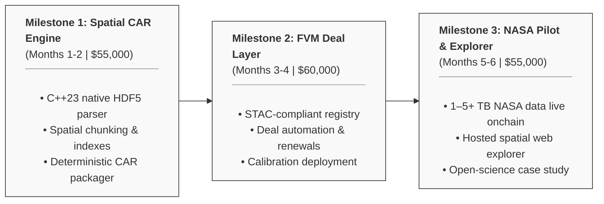
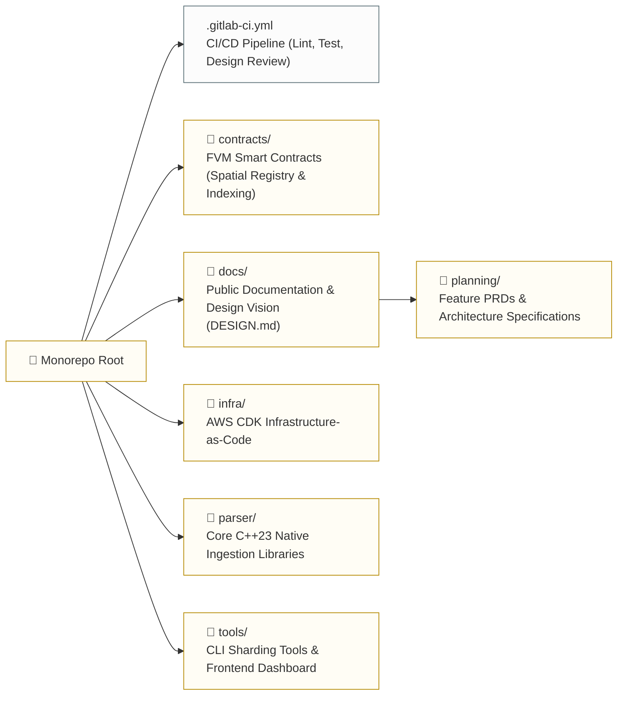

# HDF5-to-IPLD: Unlocking Petabytes of NASA Earthdata for the Filecoin Network

### Project Overview

The **HDF5-to-IPLD Tool** bridges the gap between complex
multi-dimensional scientific computing formats and decentralized Web3
storage networks. Developed under the **Decentralized Spatial Data
Infrastructure (DeSDI) Initiative**, this open-source solution
provides a specialized ingestion pipeline to parse, shard, and
permanently index critical public-good datasets, such as petabytes of
NASA earth-observation data, onto the Filecoin network.

Traditional decentralized protocols route and locate data strictly via
cryptographic Content Identifiers (CIDs) rather than geographic or
temporal coordinates. This tool extracts spatial metadata natively
during the ingestion process and integrates it with a decentralized
spatial indexing layer built on the SpatioTemporal Asset Catalog
(STAC) standard. As a result, researchers can query, index, and locate
ATLAS ICESat-2 laser altimetry products and multi-dimensional HDF5
data cubes by physical geography rather than abstract cryptographic
hashes.

-----

### Core Technical Architecture

The ingestion and processing architecture is structured into three
discrete, decoupled tiers:

1.  **The Parser & Sharding Engine:** Built with optimized, low-level
    libraries (utilizing specialized modern C++23 or Python processing
    bindings), this engine ingests raw `.h5` (HDF5), `.laz`, and Cloud
    Optimized GeoTIFF (COG) files. It natively extracts internal
    metadata attributes, shards massive scientific files into
    network-optimized blocks, and maps them directly to deterministic
    IPFS CIDs.
2.  **The Immutable Spatial Registry:** A lightweight, efficient smart
    contract layer deployed to anchor spatial data truth. It records
    geometric bounding boxes/polygons and temporal timestamps
    permanently on the blockchain, mapping them directly to their
    corresponding heavy-data IPFS CIDs.
3.  **The High-Throughput Spatial Retrieval & Explorer Layer:** To eliminate
    the inefficiency of downloading gigabytes of decentralized raw files
    to local workstations, this layer enables researchers to query
    spatial bounding boxes and stream targeted data subsets (or point tiles)
    directly from decentralized storage providers without fetching
    multi-terabyte raw blobs.

-----

### Technical Specifications & Integration

#### Filecoin Virtual Machine (FVM) Autonomous Persistence

By running smart contracts natively on the storage network via the
Filecoin Virtual Machine (FVM), the architecture automates data
persistence. FVM smart contracts actively monitor storage agreements
for the ingested NASA datasets. If a storage contract approaches its
expiration date, the contract autonomously dispatches renewal payments
to storage providers from a dedicated ecosystem endowment, ensuring
permanent, unmanaged uptime for critical scientific data.

#### The Spatial Registry Mapping Pattern

The FVM registry records lightweight data structures that link
physical geography to cryptography, acting as an unhackable
decentralized index:

  * **Geospatial Coordinates / Bounding Box:** `[MinX, MinY, MaxX,
    MaxY]` (e.g., `[-97.74, 30.26, -97.73, 30.27]`)
  * **Temporal Timestamp:** Unix epoch format (e.g., `1687453200`)
  * **Cryptographic IPFS CID:** The unique root hash of the sharded
    data cube (e.g., `bafybeig...`)

-----

### Project Milestones

```mermaid
flowchart LR
    %% Style definitions
    classDef default fill:#f9f9f9,stroke:#333,stroke-width:1px,text-align:left;

    M1["`**Milestone 1: Spatial CAR Engine**
    (Months 1-2 | $55,000)
    <hr>
    • C++23 native HDF5 parser
    • Spatial chunking & indexes
    • Deterministic CAR packager`"]

    M2["`**Milestone 2: FVM Deal Layer**
    (Months 3-4 | $60,000)
    <hr>
    • STAC-compliant registry
    • Deal automation & renewals
    • Calibration deployment`"]

    M3["`**Milestone 3: NASA Pilot & Explorer**
    (Months 5-6 | $55,000)
    <hr>
    • 1–5+ TB NASA data live onchain
    • Hosted spatial web explorer
    • Open-science case study`"]

    M1 --> M2 --> M3
```

  * **Milestone 1 (Months 1-2): Data Pipeline & Spatial CAR Engine**
      * *Deliverables:* High-performance C++23 open-source parsing
        library capable of reading `.h5` files natively, mapping photon
        attributes to spatial chunks via a cubed-sphere Hilbert curve,
        and packing them into deterministic CAR files with spatial index
        manifests. Includes CLI tooling for local dataset staging and
        sharding.
      * *Allocation:* $55,000
  * **Milestone 2 (Months 3-4): Onchain Deal Management & FVM Layer**
      * *Deliverables:* Deployment of an immutable, STAC-compliant
        spatial registry on the Filecoin Virtual Machine (FVM).
        Implementation of spatial bounding box lookup functions linking
        geographic areas to stored piece CIDs. Automated deal renewal
        orchestrator and proof-of-spacetime verification monitor on
        Calibration testnet and Mainnet.
      * *Allocation:* $60,000
  * **Milestone 3 (Months 5-6): Institutional NASA Pilot & Retrieval Showcase**
      * *Deliverables:* Live onboarding and permanent onchain storage of
        1–5+ TB of real-world NASA ICESat-2 (ATL24) data products on
        Filecoin mainnet storage providers. Publicly hosted web explorer
        demonstrating sub-second spatial queries and chunk downloads. Full
        developer quickstart, documentation, and open-science case study.
      * *Allocation:* $55,000
  * **Direct Costs (Months 1-6): Infrastructure, Storage Deals & Gas**
      * *Deliverables:* High-memory staging compute for multi-gigabyte HDF5
        granule processing, Filecoin Mainnet storage deal collateral,
        provider deal fees, and transaction gas.
      * *Allocation:* $15,000
  * **Total Funding Requested:** $185,000

-----

### Repository Layout & Standards

This repository is configured as a strict Monorepo to optimize
development speed, testing, and continuous integration across all
processing layers.

```mermaid
flowchart LR
    %% Node Definitions
    root["📁 Monorepo Root"] --> ci[".gitlab-ci.yml<br>CI/CD Pipeline (Lint, Test, Design Review)"]
    root --> contracts["📁 contracts/<br>FVM Smart Contracts (Spatial Registry & Indexing)"]
    root --> docs["📁 docs/<br>Public Documentation & Design Vision (DESIGN.md)"]
    root --> infra["📁 infra/<br>AWS CDK Infrastructure-as-Code"]
    root --> parser["📁 parser/<br>Core C++23 Native Ingestion Libraries"]
    root --> tools["📁 tools/<br>CLI Sharding Tools & Frontend Dashboard"]

    docs --> planning["📁 planning/<br>Feature PRDs & Architecture Specifications"]

    %% GitLab-Safe Styles
    classDef folder fill:#fffdf5,stroke:#b58900,stroke-width:1px,text-align:left;
    classDef file fill:#fcfcfc,stroke:#586e75,stroke-width:1px,text-align:left;

    class root,contracts,docs,infra,parser,tools,planning folder;
    class ci file;
```

#### Infrastructure & Deployment Principles

  * **Declarative Infrastructure:** All deployments are managed
    entirely as infrastructure-as-code. Manual console configurations
    are prohibited to maintain environment replicability.
  * **Quality Gates & Quality Control:** Frontend modifications are
    gated by visual automated checks verifying compliance against the
    guidelines mapped out in `docs/DESIGN.md`. Backend changes
    require local unit execution and integration runs utilizing
    isolated database testing environments.
